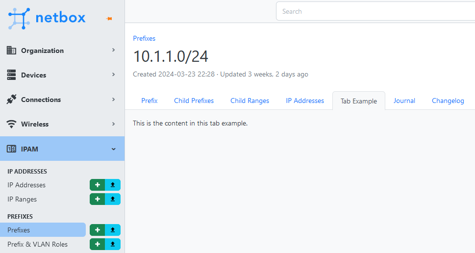

# NetBox Tab Example Plugin

This is an example plugin for NetBox, showing a new "Tab Example"
tab in the prefix view.




## Installation

Install the plugin code in the NetBox venv and set it to install on every NetBox upgrade:

```shell
cd /opt/netbox
sudo venv/bin/pip install git+https://github.com/markkuleinio/netbox-tab-example
sudo sh -c "echo git+https://github.com/markkuleinio/netbox-tab-example >> local_requirements.txt"
```

Add the plugin name `netbox_tab_example` in the NetBox plugins list configuration in
`/opt/netbox/netbox/netbox/configuration.py`:

```python
PLUGINS = [
    ...
    "netbox_tab_example",
]
```

Restart NetBox:

```shell
sudo systemctl restart netbox netbox-rq
```


## Compatibility

Version 1.0 has been tested with NetBox 3.7.5 and 4.0-beta1


## Comments

This plugin only offers the new "Tab Example" tab in the prefix view. There are
no other views, thus `views.TabExampleView.get()` is customized to only work in the tab,
and `urls.urlpatterns` is empty.
